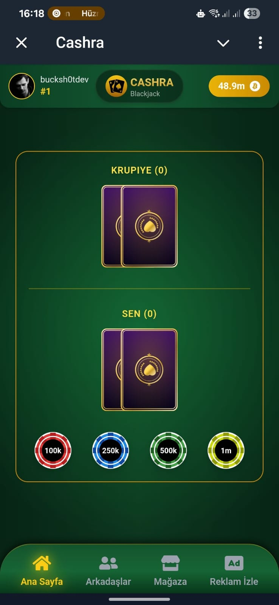
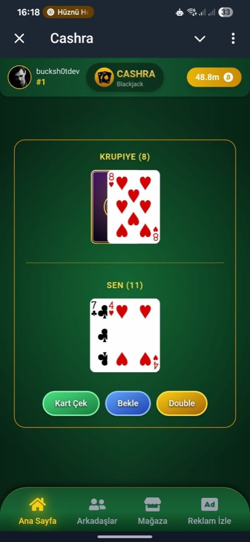

# cashra-client

> Telegram WebApp için mobil odaklı, gerçek zamanlı Blackjack arayüzü. ⚡️

[](https://github.com/bucksh0tdev/cashra-client)
[](https://github.com/bucksh0tdev/cashra-client/issues)
[](https://github.com/bucksh0tdev/cashra-client/commits/main)
[](https://react.dev)
[](https://tailwindcss.com)

## ✨ Öne Çıkanlar
- Telegram WebApp uyumluluğu ve mobil öncelikli deneyim
- WebSocket ile anlık oyun state yönetimi
- Blackjack masası, mağaza, arkadaş daveti, reklam ve ödeme ekranları
- Kart animasyonları ve etkileşimli UI

## 🧭 Mimari Akış
- Telegram WebApp → WebSocket bağlantısı
- Sunucudan gerçek zamanlı state → React render
- Kullanıcı aksiyonları → WS mesajları

## ⚙️ Kurulum
1. `.env.example` dosyasını `.env` olarak kopyala.
2. Bağımlılıkları yükle.
```bash
npm install
```
3. Dev sunucuyu başlat.
```bash
npm start
```

## 🔧 Ortam Değişkenleri
- `REACT_APP_API_URL` Backend HTTP base URL
- `REACT_APP_WS_URL` Backend WebSocket URL
- `REACT_APP_DEV_WS_URL` Opsiyonel dev WebSocket URL
- `REACT_APP_BOT_URL` QR ekranında kullanılacak Telegram bot URL
- `REACT_APP_TELEGRAM_CHANNEL_URL` Telegram kanal URL
- `REACT_APP_DEV` `true` veya `false`

## 📁 Proje Yapısı
- `src/game` Oyun sayfaları ve layoutlar
- `src/utils` Kartlar, yardımcı fonksiyonlar ve WS state
- `public/libs` Statik görseller

## 📸 Ekran Görüntüleri
<p align="center">
  
  
</p>

## 🛡️ Güvenlik Notu
- Secret ve URL değerleri `.env` içindedir.
- Repo içinde hassas bilgi tutulmaz.

## 🗺️ Yol Haritası
- Tema seçenekleri ve karanlık mod
- Performans optimizasyonları
- Daha zengin animasyon akışı

## 🤝 Katkı
- Issue açarak öneri bırakabilirsin.
- PR’larda mevcut kod stilini koru.

## 🔗 İlgili Repo
- Backend: `cashra-backend`

## 📄 Lisans
- MIT
